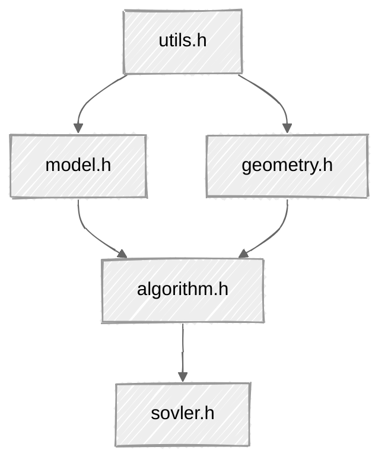

## 读取数据格式

- 使用json格式保存计算所需剖面数据

- 整体框架如下所示：

```mermaid
  %%{init: {'theme': 'neutral','look':'handDrawn'}}%%
  flowchart TD
      A["utils.h"] --> B["model.h"]
      A --> C["geometry.h"]
      B --> D["algorithm.h"]
      C --> D
      D -->E["sovler.h"]
      
```