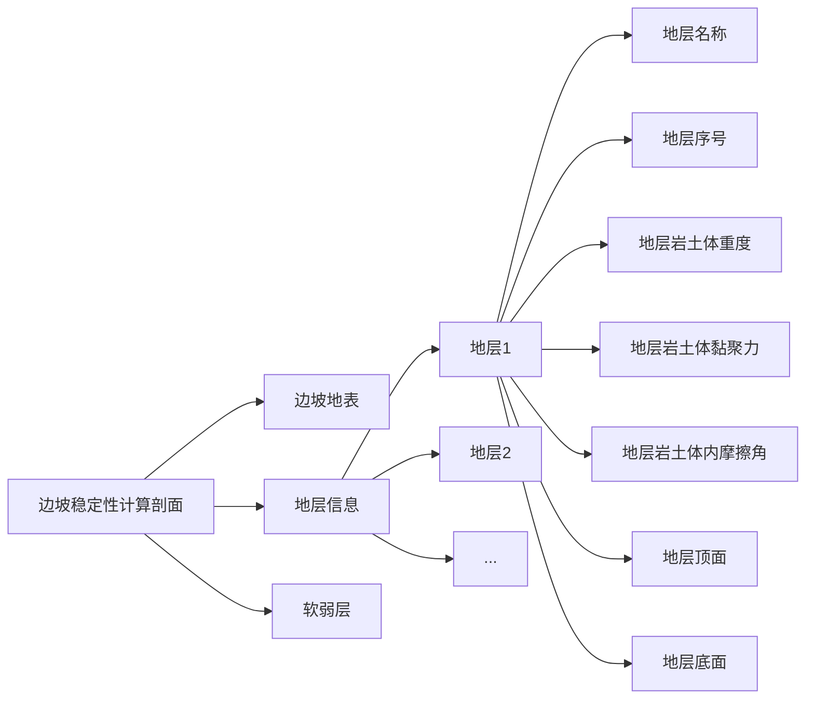

```mermaid

flowchart LR
    A["边坡稳定性计算剖面"] --> B["边坡地表"]
    A --> C["地层信息"]
    A -->D["软弱层"]
    C -->F["地层1"]
    C -->G["地层2"]
    C -->Q["..."]
    F -->H["地层名称"]
    F -->I["地层序号"]
    F -->J["地层岩土体重度"]
    F -->K["地层岩土体黏聚力"]
    F -->L["地层岩土体内摩擦角"]
    F -->M["地层顶面"]
    F -->N["地层底面"]

```
